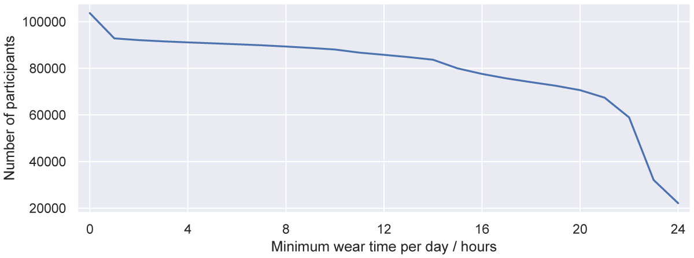

# Generate EIDs
The files in this directory are used to generate the list of EIDs (participant IDs)/CWA files that meet the inclusion critera for processing. The scripts in this folder remove records that do not have sufficent wear time (defined as 20 hours a day in our paper)

The directory also contains the annoymised final list of EIDs that were processed in our paper. **Note** that this list contains fewer EIDs than the script in this directory as they are additional inclusion critera that are processed in the plotting files in stage 3 of the processing.

## File descripition:

**Scripts:**

`generate_cwa_weartime.py` Python script to generate the list of EIDs which meet weartime inclusion critera (this file is used in stage 2 of the processing). Note, there is additional 

`generate_diabetes.py` Python script to generate list of EIDs that meet our critera of having a diagonsis of diabetes. Also generates a list of EIDs of participants with no diagonsis of diabetes.

**Input files**:

Note that input metadata files required to run these scripts are only available on application to the UK Biobank and are not included in this repository.

The input file is a csv file that is generated by extracting the ukb files downloaded the UK Biobank, by following the [guide](https://biobank.ctsu.ox.ac.uk/crystal/exinfo.cgi?src=accessing_data_guide)

**Output files:**

`desired_records.csv` CSV file containing the EIDs that meet wear time inclusion critera. This is NOT the final list of participants included in our analysis as their are additional exclusion critera in later processing steps.

`diabetes_records.csv` CSV file containing EIDs that meet our critera of having a diagonsis of diabetes. This is NOT the final list of participants with diabetes that were processed.

`non_diabetes_records.csv` CSV file containing EIDs that meet our critera of having *no* diagonsis of diabetes. This is NOT the final list of participants that were used as control group without diabetes. 

**Other files:**

`full_eid_list.txt` The full list of EIDs (pariticpants) that were available to this project

`processed_eids.txt` The full list of the EIDs that were processed in our Energy Harvesting Biobank paper (67,024 participants)

## Weartime processing `generate_cwa_weartime.py`
As described in the paper, our inclusion critera required participants to wear the accelerometer for a minimum of 20 hours each day. In the script this minimum weartime critera can be adjusted by changing the value of `required_wear` to the desired number of hours in the `generate_cwa_weartime.py` script. The plot below shows the expected number of participants for different minimum wear time critera.

The output of this script is used as an input to the second stage of processing to ensure we only process records that meet inclusion critera (thus reducing computational demand)

## Diabetes participants `generate_diabetes.py`
This script generates two files, one with all participants that meet our inclusion critera of having a diagonsis of diabetes and the other that generates all participants that do not have a diagonsis of diabetes.

These files are then used in the third stage of processing to generate comparisions between having a diagonsis of diabetes and a comparision control group.

